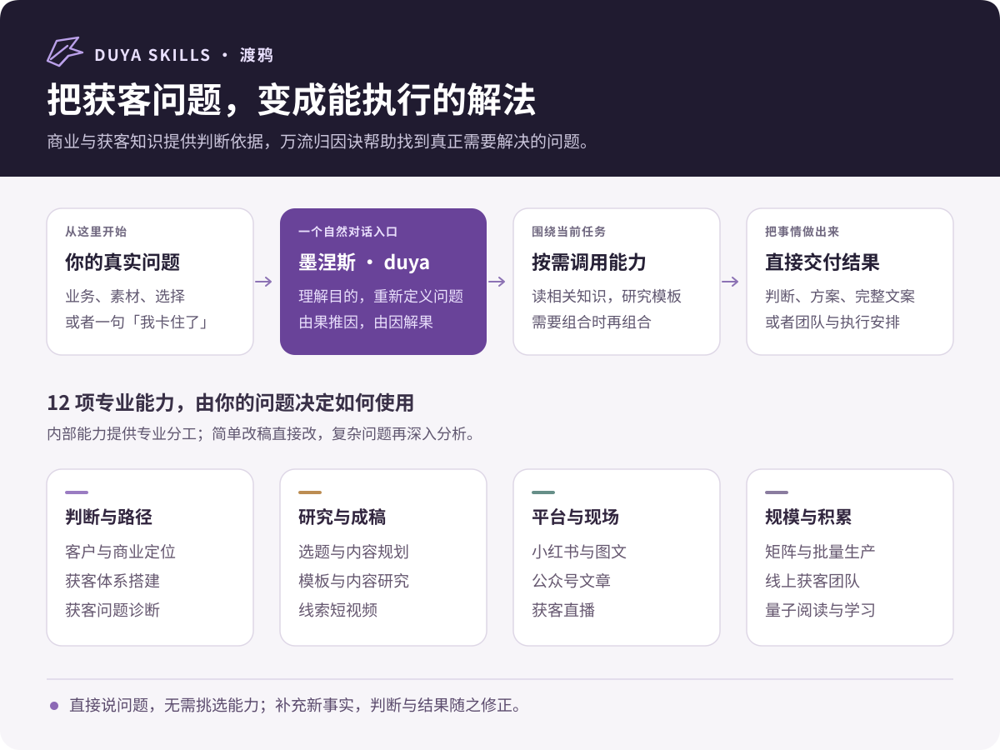
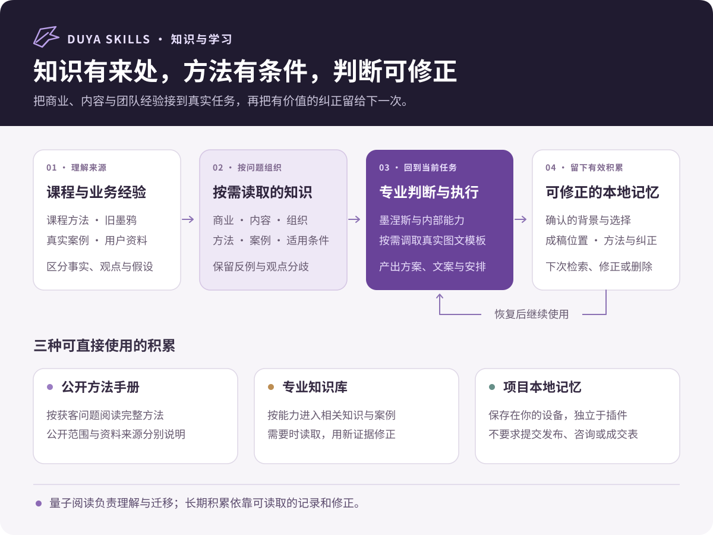

# duya-skills · Duya

[简体中文](README.md) | English

> Business and lead acquisition Skills for business owners and content teams. Give Monies your business context, materials, or current obstacle, and get a reasoned decision, a practical plan, or finished content.

[](VERSION)
[](docs/新手入门.md#skill-全目录)
[](LICENSE)

**For Codex, Claude Code, Cursor, and Agents that can load complete Skill directories.** Detailed methods and the full tutorial are currently in Chinese.

Maintained by [Duya](https://github.com/jack-duya). The professional foundation is business and lead acquisition knowledge. The Wanliu reasoning method works backward from an observed result to plausible causes, then turns that understanding into action. The package includes **one main entry, 12 business shortcuts, and one update entry**, sharing **12 business capabilities and 23 knowledge documents**.

**v0.5.0:** Quantum Reading now includes a detailed tutorial, a complete worked example, and an openable knowledge folder. Save linked Markdown notes to your chosen Obsidian vault, or use ordinary Markdown without Obsidian. [Tutorial and examples](docs/量子阅读.md)

Select `$duya-video`, `$duya-wechat`, or another shortcut directly, or keep asking through `$duya`. Version 0.4.0 and later supports “update Duya”; older ordinary installations need one full installation first. Plugins keep their native update path. [Update guide](docs/更新指南.md)

WeChat typesetting, introduced in v0.3.0, includes **12 original themes**, copyable article HTML, browser previews, and validation reports. [Typesetting guide](docs/公众号排版.md) · [12-theme gallery](https://jack-duya.github.io/duya-skills/wechat-gallery/)

[Quick start](#quick-start) · [Installation](#installation) · [Capabilities](#capabilities) · [Public handbook](#public-handbook) · [Full tutorial](docs/新手入门.md) · [Changes](CHANGELOG.md)



## What duya-skills helps with

| Your situation | What you get |
|---|---|
| You have a product but cannot explain who needs it or why they would buy | Customer situations, buying reasons, positioning, and product fit |
| You want to start acquiring customers online | Platform and format choices, preparation, and a practical starting plan |
| Content gets views but few suitable inquiries | A diagnosis and concrete changes to audience, content, or the acquisition path |
| You want more accounts, equipment, or distribution | A comparison of actual constraints and suitable ways to expand |
| Your writing sounds generic or overly technical | Finished image posts, short-video scripts, headlines, or articles |
| Your WeChat draft is ready, but formatting takes too long | A suitable theme and copyable, previewable formatting that preserves your text |
| You found popular content but cannot adapt it | Template retrieval, mechanism analysis, and a grounded adaptation |
| The owner rewrites everything and staff do not know what to film | Roles, material collection, production, and training arrangements |
| Courses and previous decisions are difficult to reuse | Reading, method integration, and recoverable local records |

## Quick start

After installing, ask in Codex:

```text
$duya I run a local renovation company. Our construction videos attract other
contractors, but few homeowners ask about our services. I want more accounts,
but the owner dislikes long talking-head recordings. Diagnose what to improve
first and write one video we can produce with our existing material.
```

For a specific task, ask directly:

```text
$duya Find a cleaning-service template and write a Xiaohongshu image post.
$duya Rewrite this video opening without changing the facts.
$duya Keep this article's text unchanged, choose a suitable theme, and produce HTML I can copy into the WeChat editor: …
$duya Design content production for three stores and one editor.
$duya Read this course and extract methods that apply to my business.
```

For a specific capability, use `$duya-video` or `$duya-wechat` in Codex. Claude Code direct installation uses `/duya-video`; marketplace installation uses `/duya:duya-video`. The main entries remain `/duya` and `/duya:duya` respectively.

## Capabilities

Use `$duya` for natural conversation and task composition. The 13 shortcuts below share its core instructions and knowledge; the first 12 handle business tasks, and the last maintains your installation.

| Codex shortcut | Purpose |
|---|---|
| `$duya-positioning` | [Positioning](skills/duya-positioning/SKILL.md): identify customers, buying reasons, and how the product supports its promise |
| `$duya-acquisition` | [Acquisition](skills/duya-acquisition/SKILL.md): choose platforms, formats, preparation, and a practical starting plan |
| `$duya-diagnose` | [Diagnosis](skills/duya-diagnose/SKILL.md): investigate views, inquiries, audience mismatch, account issues, and ineffective investment |
| `$duya-content-plan` | [Content planning](skills/duya-content-plan/SKILL.md): choose concrete topics, angles, formats, and production priorities |
| `$duya-research` | [Research](skills/duya-research/SKILL.md): retrieve real templates, explain their mechanisms, and adapt adjacent niches |
| `$duya-video` | [Video](skills/duya-video/SKILL.md): deliver complete lead-oriented scripts, stronger openings, and shot arrangements |
| `$duya-xhs` | [Xiaohongshu](skills/duya-xhs/SKILL.md): write headlines, covers, single images, notes, and image sequences |
| `$duya-wechat` | [WeChat writing and typesetting](skills/duya-wechat/SKILL.md): write, revise, or preserve an article while generating themed HTML, a preview, and a report |
| `$duya-live` | [Livestreaming](skills/duya-live/SKILL.md): plan topics and scripts, or turn recording problems into replacement passages |
| `$duya-matrix` | [Matrix production](skills/duya-matrix/SKILL.md): organize owned accounts, partner distribution, and repeatable content production |
| `$duya-team` | [Teams](skills/duya-team/SKILL.md): decide whom to hire, how to assign work, and how to train and evaluate |
| `$duya-learning` | [Learning](skills/duya-learning/SKILL.md): explain methods, build complete applications, save Markdown knowledge with optional Obsidian links, and reuse it later |
| `$duya-update` | [Update Duya](skills/duya-update/SKILL.md): check or update the installation, preserve backups and memory, and explain how to reload |

See the [full capability directory](docs/新手入门.md#skill-全目录) for examples and expected deliverables.

### WeChat writing and typesetting

Ask Duya to write and format an article, or provide a finished draft for formatting only. The 12 original themes vary in composition, heading treatment, quotations, typography, and reading rhythm. They support briefs, plans, stories, opinions, tutorials, Q&A, brand articles, checklists, interviews, and long reads. Duya chooses a suitable theme when you have no preference.

Each render produces three files: **article `.html`, browser `.preview.html`, and validation `.report.json`**. Open the preview and copy the article into the WeChat editor. If the copy button is unavailable, select the article and copy it manually. Check formatting, images, and tables in the actual editor and mobile preview before publishing.

The local renderer uses the **Python 3.10+ standard library**, with no additional pip dependencies. Your Agent needs file access and Python execution. Access the same WeChat capability through `$duya-wechat` or the main `$duya` entry.

[Typesetting guide](docs/公众号排版.md) · [Browse all 12 themes](https://jack-duya.github.io/duya-skills/wechat-gallery/)

## Installation

### Skills CLI

```bash
npx -y skills add jack-duya/duya-skills -g --skill '*'
```

Select your Agent, or append a specific client such as `--agent codex`, then start a new conversation. `--skill '*'` installs all **14 entries in this repository**, including the shared core, knowledge, and tools; it is not the `--all` option for every Agent. Shortcuts need a sibling `duya` core. Installing only `--skill duya` still supports every business capability through conversation, but omits independent shortcuts.

Add the template MCP separately using the [installation guide](docs/安装指南.md#模板-mcp-配置).

### Claude Code marketplace

```bash
claude plugin marketplace add jack-duya/duya-skills
claude plugin install duya@duya-skills
```

This plugin includes all 14 entries, shared knowledge, and the template MCP configuration. Restart the session and use `/duya:duya` or a shortcut such as `/duya:duya-video`.

### Updates

With **0.4.0 or later**, say “update Duya” in a Duya conversation or use `$duya-update`. “Check for updates” is read-only. Ordinary installations through 0.3.x lack the updater; first run the full installation command above once. Claude Code plugin users can update through the native plugin channel without adding a separate Skill installation.

For ordinary installations, the Python 3.10+ updater pins the latest official `main` commit for the download. It backs up official files before replacement, preserves unknown personal files, and leaves `~/.duya/memory/` untouched. Your edits to official files remain in the backup while new official content takes effect. Plugin caches use native plugin updates; Git checkouts update only from the correct origin with a clean working tree and a fast-forward. Failures are reported, and you may need a new conversation to reload. See the [update guide](docs/更新指南.md).

## How it works

```text
Your task or material
         ↓
Monies uses context to identify the current need
         ↓
Reframe when necessary; load relevant knowledge and templates
         ↓
Complete a decision, plan, or piece of content
         ↓
Use your corrections and save useful context when appropriate
```

A small edit stays small. A valid expansion request gets an expansion plan. There is no mandatory workflow to complete before receiving useful work.

## Knowledge and local records

The [knowledge library](skills/duya/knowledge/INDEX.md) covers business, content, operations, and learning. [Source notes](skills/duya/knowledge/SOURCES.md) distinguish source claims, examples, and new recommendations.

The template MCP returns relevant text and image URLs. Local file tools can save, retrieve, correct, and delete project records. This is actual file storage, not background model training. You do not need a publication log, CRM, or complete sales dataset to use the Skill.

Quantum Reading can save detailed notes, sources, applications, and meaningful links to an existing Obsidian vault chosen by you. No extra MCP or community plugin is required. Without Obsidian, the same knowledge remains usable as Markdown. [Detailed tutorial](docs/量子阅读.md) · [Working example folder](docs/learning-example/) · [Example ZIP](docs/quantum-reading-example.zip)


The screenshot was supplied by the user and shows an existing knowledge library. It was not generated from the six-note example or validated as a learning outcome. The downloadable example contains the actual notes and links produced by this release.

## Public handbook

- [Business and lead acquisition handbook](books/渡鸦-商业与线索获客手册.md), in Chinese.
- [Worked usage examples](docs/使用案例.md), in Chinese.

Original course texts, private client files, and personal memory are not distributed in the public package.



## Contributors

Maintained by [Duya](https://github.com/jack-duya). Concrete examples and corrections are welcome; see [CONTRIBUTING.md](CONTRIBUTING.md).

The page and tutorial organization is inspired by [dontbesilent2025/dbskill](https://github.com/dontbesilent2025/dbskill). Duya's positioning, descriptions, examples, and diagrams have been rewritten. See [NOTICE.md](NOTICE.md).

## Author and support

Author: **Duya · jack-duya** · [GitHub profile](https://github.com/jack-duya)

Report usage problems through [Issues](https://github.com/jack-duya/duya-skills/issues). For commercial licensing, contact Duya through the contact information on the GitHub profile.

## License

Duya-owned materials are licensed under [CC BY-NC 4.0](LICENSE). Attribution and noncommercial conditions apply; commercial use requires separate permission. Third-party rights remain with their respective owners.

These methods and examples are not guarantees of traffic, leads, or revenue.
