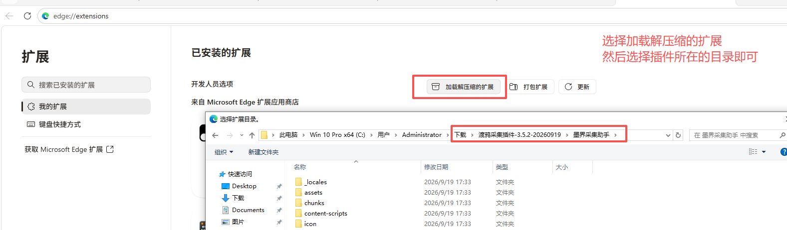
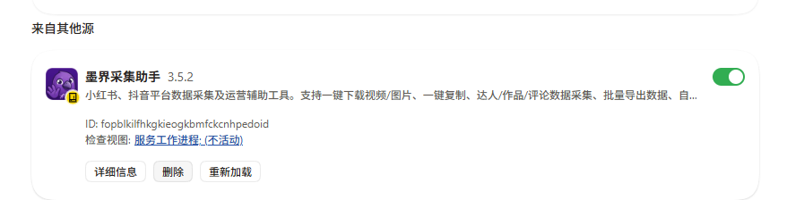
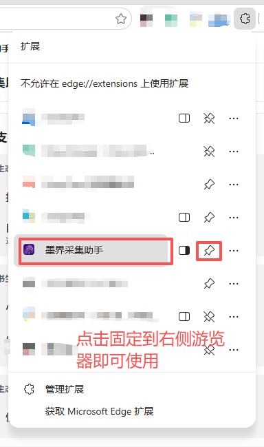
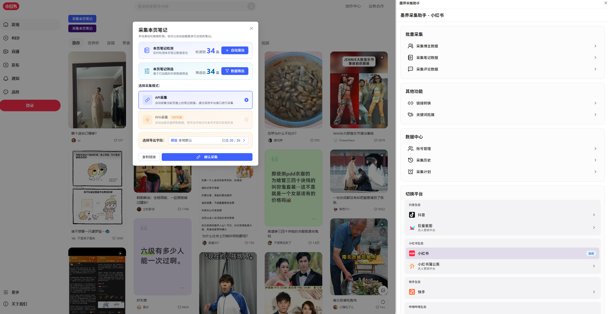

# 渡鸦采集插件使用教程

[返回采集 Skill](../SKILL.md) · [查看平台与功能目录](../catalog.md) · [渡鸦 GitHub 首页](https://github.com/jack-duya/duya-skills)

渡鸦采集插件在浏览器里的名称是 **墨界采集助手**。本教程配合用户提供的四张实操截图，说明如何加载插件、固定入口，以及在小红书页面开始采集。截图中的插件版本为 **3.5.2**，与本仓库内置版本一致；截图中的文件夹名称、扩展 ID 和笔记数量以各自电脑的实际显示为准。

你可以直接在浏览器中手动使用，也可以安装 `moyaclaw-collect` Skill，让 AI 按你给的平台、关键词或链接下发采集任务。手动安装以下面的 Edge 截图为例；AI 调用使用 Skill 脚本管理的独立 Chrome 窗口。

## 一、准备插件文件

如果已经拿到插件压缩包，先解压到一个准备长期保留的文件夹。

也可以从[渡鸦 GitHub 仓库](https://github.com/jack-duya/duya-skills)点击 **Code → Download ZIP**，解压后找到：

```text
duya-skills-main/
  skills/
    moyaclaw-collect/
      extension/            ← 在浏览器里选择这个文件夹
        manifest.json
        _locales/
        assets/
        content-scripts/
        icon/
        ...
```

**选择的文件夹内应能直接找到 `manifest.json`。** 从本仓库下载时是 `extension`；截图中单独分发的插件文件夹叫“墨界采集助手”，两种情况下都以 `manifest.json` 所在位置为准。

## 二、加载解压缩的扩展

1. 打开 Microsoft Edge，在地址栏输入 `edge://extensions/`。
2. 开启扩展管理页面的“开发人员模式”或“开发人员选项”。
3. 点击 **加载解压缩的扩展**。
4. 选中上一步找到的插件文件夹，确认加载。



图 1：红框标出了加载入口和插件目录。Chrome 手动安装可从 `chrome://extensions/` 进入对应页面。

## 三、确认插件已启用

加载后，扩展列表中应出现 **墨界采集助手**。确认右侧开关处于开启状态。



图 2：插件已出现在“来自其他源”的扩展列表中。版本号用于核对你安装的文件，扩展 ID 无需与截图相同。

保留加载时选中的文件夹。以后手动替换其中的插件文件后，可以回到扩展管理页点击“重新加载”，再刷新要操作的平台网页。

## 四、固定到浏览器工具栏

1. 点击浏览器右上角的扩展图标。
2. 找到 **墨界采集助手**。
3. 点击旁边的图钉，将它固定到工具栏。
4. 打开要操作的平台网页，再点击工具栏里的插件图标。



图 3：固定后可以直接从工具栏打开插件。截图顶部的“不允许在 edge://extensions 上使用扩展”对应的是扩展管理页；实际使用时切换到小红书、抖音等目标平台网页。

## 五、打开平台并开始采集

下面以小红书为例：

1. 打开小红书网页，并完成所需的平台账号与插件账号登录。
2. 进入你要研究的搜索结果、博主或笔记页面。
3. 点击墨界采集助手图标，打开右侧面板，确认显示的是 **墨界采集助手－小红书**。
4. 根据任务选择“采集博主数据”“采集笔记数据”或“采集评论数据”，再填写页面要求的关键词、链接和数量。

插件也提供截图中展示的 **采集本页笔记** 手动入口。打开后，可以查看当前检测到的笔记，滚动加载更多内容、使用数据筛选、选择采集方式和导出字段，再点击“确认采集”。



图 4：左侧展示本页笔记的检测、筛选、采集方式和字段选择；右侧展示博主、笔记、评论采集，以及链接转换、关键词拓展、采集历史等入口。点击图片可查看原图。

界面中的“检测到 34 篇”是截图当时加载的候选数量。实际采集结果查看任务完成状态和“采集历史”；需要文件时，使用结果页面实际提供的导出入口。截图中的 RPA 采集标有“VIP 可用”，具体可选方式与权限以当前账号界面为准。

这张图展示浏览器插件的手动操作界面。当前 AI Skill 的自动任务按[功能目录](../catalog.md)调用侧栏入口，不能据此推断截图上的所有按钮都已接入 AI。

## 六、让 AI 帮你调用采集插件

这一方式需要支持本地脚本执行的 Agent、Node.js、Google Chrome，以及已安装的 `moyaclaw-collect` Skill。只安装渡鸦核心 `duya` 时，不会自动获得这个独立采集 Skill；安装仓库全部 Skills 时可一并选择它。

如果需要单独安装，可在终端运行：

```bash
npx -y skills add jack-duya/duya-skills -g --skill moyaclaw-collect
```

安装后，在支持该快捷入口的 Codex 中可以这样提问：

```text
$moyaclaw-collect 在小红书按关键词“旧房翻新”采集 20 篇笔记。
```

```text
$moyaclaw-collect 在抖音按关键词“家政保洁”采集 20 条视频。
```

```text
$moyaclaw-collect 采集下面这些小红书笔记的评论，每篇最多 30 条：
【粘贴笔记链接】
```

AI 会按 Skill 的工作流启动独立 Chrome、检查登录，再提交相应任务。首次使用时，在它打开的窗口里完成登录，然后告诉 AI 继续。这个窗口与手动装插件的 Edge 窗口分别使用各自的登录状态；在 Edge 登录过，不代表独立 Chrome 已登录。

任务提交后，要继续查看完成状态与实际结果。仅出现“已下发任务”并不表示已经采集完成。脚本参数、环境变量和完整调用方式见[采集 Skill 说明](../SKILL.md)。

## 七、常见问题

| 遇到的情况 | 处理方法 |
|---|---|
| 加载时提示找不到清单文件 | 确认压缩包已解压，选中的文件夹内直接包含 `manifest.json`，而不是选到整个仓库或插件的上一级目录 |
| 安装成功，但工具栏没有图标 | 打开扩展菜单，找到墨界采集助手，点击图钉固定 |
| 扩展管理页提示不允许使用扩展 | 切换到实际平台网页，再打开插件 |
| 侧栏平台与当前任务不一致 | 打开并选中对应平台的标签页，再选择该平台入口 |
| 插件或平台提示未登录 | 在当前实际操作的浏览器窗口完成对应登录，再继续任务 |
| 某个采集方式不可选 | 查看当前账号权限与界面提示，例如截图中的 RPA 方式标有“VIP 可用” |
| AI 没有找到采集入口 | 确认已安装独立的 `moyaclaw-collect`，并按客户端需要重新加载 Skills 或新开对话 |

想把采集结果继续用于对标拆解、选题或文案，可以把实际导出的文件交给渡鸦，并说明你要解决的业务问题。判断基于已取得的材料展开，不把页面候选数或任务提交状态当作完整采集结果。
